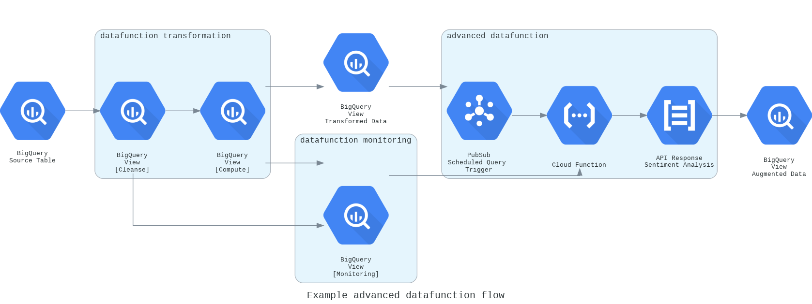

#Advanced Functions

##Summary
Advanced functions require more complex configuration, but enable users to leverage the power of an advanced set of Google Cloud Platform API functions.

By using a combination of simple or complex chains of datafunctions, scheduled queries, pub/sub triggers and cloud functions, new or backlog data can be augmented with responses from any number of Google or external APIs.

**Example flow:**

## Google APIs

###Geospatial

####BigQuery GIS

####Geocoding

####Distance Matrix

####Places

###Machine Learning

####BigQuery ML

####Cloud Vision

####Cloud Speech to Text

####Translation

####Cloud Natural Language

## External APIs
Custom integrations to external APIs can potantially also be developed according to requirements.

